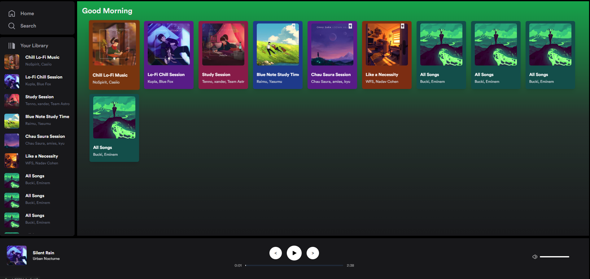

# Clon de Spotify

## Descripcion

Creado con Fines didacticos, utilizando Astro, React, Tailwind y Zustand

## Funcionalidades
-Reproductor de Musica con estado Global y Persistente
-Transisiones entre paginas utilizando las imagenes de los album
-Manejo de Volumen
-Agregar canciones individualmente a la Queve
-Diseño Responsive
-Aun quiero añadirle un par mas

## Demo
Para acceder a la demo visita la <a target="_blank" href="https://elaborate-sopapillas-9fc246.netlify.app/">`Pagina Demo`</a>
